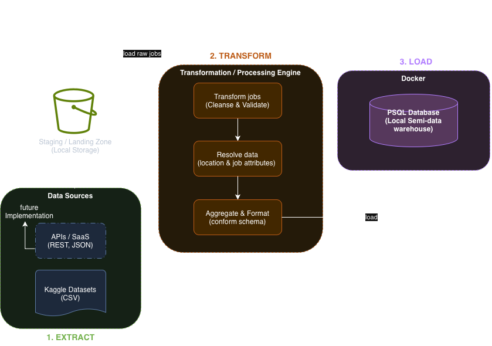

# System Architecture

## Overview

The system consists of four major components:

1. Data Source
2. ETL Pipeline
3. PostgreSQL Database
4. Frontend Dashboard (Work in progress)

---

## Architecture Diagram

## Component Responsibilities

### Data Source

Obtains job listings from Kaggle.

### Extract

Downloads the latest dataset.

### Transform

- Cleans salary
- Normalizes locations
- Removes duplicates

### Load

Loads processed data into PostgreSQL.

### Frontend

Displays analytics and search.